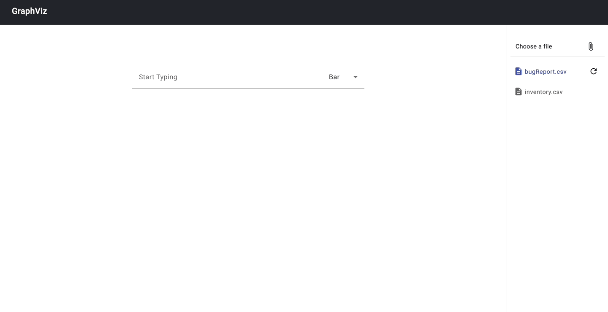

# Graphviz: SQL Database Visualization Tool

This is the frontend component of the Graphviz project. 
To enable backend functionality, a separate service needs to be initiated. GitHub repository for the backend - [graphviz-backend](https://github.com/Sheel-ui/graphviz-backend)

## Installation

1. Clone this repository:

   ```bash
   $ git clone https://github.com/Sheel-ui/graphviz-frontend.git

2. Navigate to the project directory:

   ```bash
   $ cd graphviz-frontend
   ```

3. Install dependencies:

   ```bash
   $ npm install
   ```

## Usage

To start the development server, run:

```bash
$ ng serve
```

This will start the server at `http://localhost:4200/` by default.

# Demo



